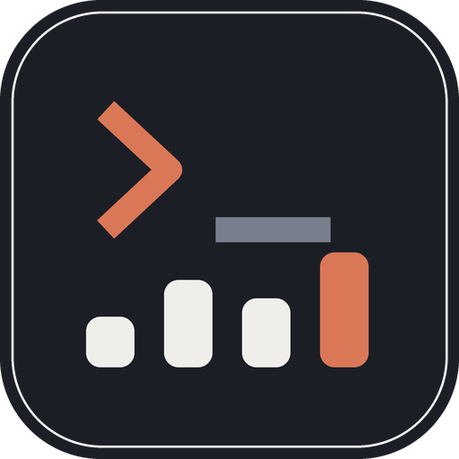

# Agentboard

A local desktop application for browsing, analysing and tidying the data
Claude Code keeps in `~/.claude`.

It opens in a native OS window, works with no network connection, and
treats `~/.claude` as read-only apart from two operations you ask for
explicitly: moving a transcript to a recoverable trash, and editing a
`CLAUDE.md` (which takes a timestamped backup first).



---

## What it does

**Conversation history.** Every session, grouped by project, with title,
branch, dates, message count, duration, tokens, estimated cost and file
size. Sort by recency, duration, cost, size or message count; filter by
project, model, tool, tag or favourite.

**Full-text search** across every transcript, including prose, thinking,
tool arguments and tool output. On a 190 MB history this takes under a
second, and each hit links straight to the message.

**Conversation viewer** with virtualised scrolling, Markdown rendering,
syntax-highlighted code with a copy button per block, and collapsible
thinking, tool calls and tool results. Sub-agent branches and errors are
marked. Export to Markdown, HTML or JSON through a native save dialog.

**Usage dashboard** with token, cost and tool statistics by day, week or
month, per project and per model, plus an activity heatmap and disk usage.
Costs come from a pricing table you control.

**Maintenance.** Delete single or many sessions into a recoverable trash,
with bulk rules for old, aborted or orphaned sessions. Restore anything
until it is purged.

**Resume** a session in a new terminal, in its original directory.

**Configuration**: a read-only view of Claude Code's own settings, a
`CLAUDE.md` editor, a browser for skills, commands and agents, and a todo
viewer.

---

## Install

One command. It installs the app and gives you a `agentboard`
command you can run from anywhere.

**macOS and Linux**

```sh
curl -fsSL https://raw.githubusercontent.com/Tataneeeeeeeeeee/Claude-Dashboard/main/install.sh | bash
```

**Windows** (PowerShell)

```powershell
irm https://raw.githubusercontent.com/Tataneeeeeeeeeee/Claude-Dashboard/main/install.ps1 | iex
```

Then:

```sh
agentboard
```

That is the whole installation. You need **Python 3.11 or newer**; the
installer checks for it and stops with instructions if it is missing.

### Linux also needs the GTK WebKit backend

It cannot be installed with `pip`, so install it with your package manager
before or after running the command above:

| Distribution | Command |
| --- | --- |
| Arch | `sudo pacman -S --needed webkit2gtk-4.1 python-gobject` |
| Debian / Ubuntu | `sudo apt install python3-gi gir1.2-webkit2-4.1` |
| Fedora | `sudo dnf install python3-gobject webkit2gtk4.1` |

The installer tells you if it is missing and carries on regardless, so you
can install it afterwards. On Windows the webview is **WebView2**, which
ships with Windows 10 and 11. On macOS it is **WKWebView**, part of the
system. Neither needs anything installed.

### What the command does

| | |
| --- | --- |
| Installs to | `~/.local/share/agentboard` (Windows: `%LOCALAPPDATA%\Agentboard`) |
| Creates | `agentboard` in `~/.local/bin` (Windows: `WindowsApps`) |
| Adds | a desktop entry, so the app appears in your application menu |
| Touches | nothing else, and never `~/.claude` |

It builds its own virtual environment, so it cannot disturb your system
Python packages. On Windows the launcher runs through `pythonw.exe`, so no
console window appears.

The window opens and your terminal is handed straight back to you. The app
is detached, so closing the terminal does not close it.

The command forwards every option:

```sh
agentboard --foreground            # stay attached and watch the output
agentboard --check                 # report the webview backend
agentboard --headless --browser    # run without a native window
agentboard --debug                 # open the webview inspector
```

Anything that prints to the terminal keeps the foreground automatically,
so `--check` and `--version` still show their output. Everything a
detached run writes goes to `~/.agentboard/launch.log`, and if the
app dies during start-up the command prints the reason instead of
returning quietly.

### Updating

Run the same command again. It replaces the application and its virtual
environment, and leaves your config, cache, trash and backups alone.

### Removing it

```sh
curl -fsSL https://raw.githubusercontent.com/Tataneeeeeeeeeee/Claude-Dashboard/main/install.sh | bash -s -- --uninstall
```

```powershell
irm https://raw.githubusercontent.com/Tataneeeeeeeeeee/Claude-Dashboard/main/install.ps1 | iex; install.ps1 -Uninstall
```

This removes the application, its virtual environment and the launcher.
Your data is left alone: `~/.claude` belongs to Claude Code, and
`~/.agentboard` holds this app's config, cache, trash and backups.
Delete that second directory by hand if you want it gone too.

### Installing somewhere else, or from a fork

```sh
curl -fsSL https://raw.githubusercontent.com/Tataneeeeeeeeeee/Claude-Dashboard/main/install.sh | AGENTBOARD_PREFIX=/opt/agentboard \
  AGENTBOARD_BIN=/usr/local/bin bash
```

`AGENTBOARD_SRC` overrides where the source comes from, and accepts a
git URL, a `.tar.gz`, a `.zip` or a local path.

> If the installer warns that the launcher directory is not on your `PATH`,
> it prints the exact line to add to your shell profile. Until you add it,
> run the full path it shows you.

---

## Building a standalone executable

Optional, and not an installation route: the command above is all you need
to use the app. This is for handing someone a single file that runs with no
Python at all. From a checkout:

```sh
./build.sh          # macOS and Linux
build.bat           # Windows
```

The result is in `dist/`:

| Platform | Output |
| --- | --- |
| Windows | `dist\Agentboard.exe` |
| macOS | `dist/Agentboard.app` |
| Linux | `dist/Agentboard` |

It is a single windowed file that opens with a double-click, needs no
Python installation, and shows no terminal window. Add `--clean` to rebuild
from scratch.

On Linux the GTK and WebKit libraries come from the system rather than the
bundle, so the binary runs on machines that have `webkit2gtk-4.1`
installed. Windows and macOS bundles are self-contained.

---

## Configuration

Settings live in `~/.agentboard/config.json`, which the application
creates on first run. A copy of the defaults is in `config.json` in this
repository. Most of it is editable from the **Config** tab.

| Key | Meaning |
| --- | --- |
| `window` | size, position and maximised state, restored on launch |
| `theme` | `system`, `light` or `dark` |
| `minimize_to_tray` | closing the window hides it instead of quitting |
| `auto_refresh` | watch the filesystem and update the list live |
| `trash_retention_days` | how long deleted sessions stay recoverable; `0` disables purging |
| `pricing` | the price table below |
| `terminal` | how to open a terminal, and the resume command |
| `editor_command` | used by the "Editor" button; usually `code` |
| `favorites`, `tags`, `notes` | your annotations, kept out of `~/.claude` |

### The pricing table

Costs shown anywhere in this application are **local estimates**, not
billing data. They are computed from a table you own:

```json
"claude-opus-5": {
  "input": 5.00,
  "output": 25.00,
  "cache_write_5m": 6.25,
  "cache_write_1h": 10.00,
  "cache_read": 0.50
}
```

Values are US dollars per **million** tokens. Cache writes are charged by
time-to-live: the one-hour tier costs about twice the input rate, the
five-minute tier about 1.25 times. A model with no entry falls back to the
`default` row.

The starting values were derived by fitting the four token counters against
the `costUSD` figures Claude Code recorded in its own `cost-state` entries;
for `claude-opus-5` the fit reproduces those figures exactly. Even so, the
estimate is a **lower bound**: Claude Code bills for background work, such
as title generation, that never appears in a transcript. Where a session
recorded its own cost, the dashboard shows that figure alongside.

Edit the table in the Config tab, or in `config.json` directly. Every
estimate updates immediately.

### The terminal command

"Resume" opens a terminal in the session's original directory and runs
`claude --resume <session-id>`. The built-in detection tries, in order:

- **Windows** — Windows Terminal (`wt.exe`), then `cmd.exe`
- **macOS** — Terminal.app, then iTerm, via AppleScript
- **Linux** — `x-terminal-emulator`, `gnome-terminal`, `konsole`,
  `xfce4-terminal`, `alacritty`, `kitty`, `wezterm`, `foot`, `xterm`

To use something else, set an argv template in `config.json`. Nothing is
passed through a shell, so paths with spaces or quotes are safe:

```json
"terminal": {
  "linux": [["kitty", "--directory", "{cwd}", "sh", "-c", "{command}"]],
  "resume_command": "claude --resume {session_id}"
}
```

`{cwd}`, `{session_id}` and `{command}` are substituted.

---

## How it works

### Reading the data

`~/.claude/projects/<encoded-path>/<session-id>.jsonl` holds one JSON
object per line. `SCHEMA.md` documents the format as it was found on a real
install, including several things that are easy to get wrong. The two that
matter most:

- **One API response is written as several lines**, each repeating the same
  `message.usage`. Summing line by line overstates tokens and cost by about
  57%. The indexer charges each response once, keyed on `message.id`.
- **Cache writes are priced by TTL.** The 1-hour tier costs twice the input
  rate. Pricing every cache write at the 5-minute rate understates cost by
  roughly a third.

Transcripts are streamed, never loaded whole: the largest on the reference
install is 30 MB. A cold index of 190 MB takes about half a second, and
results are cached in `~/.agentboard/cache.json` keyed by path, mtime
and size, so later launches are instant.

Search needs no term index. It reads each file as raw bytes and rejects
non-matching files in a single pass, then parses only the lines that hit.

### The application

A FastAPI server binds `127.0.0.1` on a **random free port** and runs in a
background thread; it refuses to bind any other interface. A pywebview
window loads that port. Closing the window stops the server, joins its
thread and exits, leaving nothing behind.

| Module | Responsibility |
| --- | --- |
| `paths.py` | filesystem locations, the project-name encoding, the containment check |
| `config.py` | user configuration and the pricing table |
| `parser.py` | streaming JSONL reader |
| `indexer.py` | session index, disk cache, full-text search |
| `usage.py` | token, cost and tool aggregation |
| `exporters.py` | Markdown, HTML and JSON rendering |
| `actions.py` | trash, restore, terminal launch — the only writes |
| `content.py` | `CLAUDE.md`, skills and commands, todos, backup |
| `watcher.py` | coalescing filesystem watcher |
| `api.py` | the HTTP surface |
| `server.py` | uvicorn on loopback, in a thread |
| `app.py` | pywebview window, native menu, tray |

The front end is plain HTML, CSS and JavaScript with no build step and no
CDN. The Markdown renderer, the syntax highlighter and the charts are all
in `agentboard/web/`, so the application works with no network.

### Safety

Deletion is a **move**, never an unlink. Files go to
`~/.agentboard/trash/<timestamp>/` with a manifest, and can be
restored until the retention period expires.

Every destructive call is validated first. A path is rejected unless it is
a plain `.jsonl` file, with no `..` component, that is not a symlink and
does not pass through one, resolving strictly inside `~/.claude/projects`
at exactly `<projects>/<project>/<session>.jsonl`. Configuration files are
refused by name as well. Validation covers the whole batch before anything
moves, and a failure part-way rolls back.

The `CLAUDE.md` editor is equally narrow: the target must be named
`CLAUDE.md` or `CLAUDE.local.md`, must not be a symlink, and must sit in
`~/.claude` or in a project the index already knows. A timestamped copy
goes to `~/.agentboard/backups/` before every save.

Favourites, tags and notes are kept in the dashboard's own config, so
annotating a session never modifies Claude Code's data.

---

## Keyboard shortcuts

| Key | Action |
| --- | --- |
| `/` | focus search |
| `j` / `k` | next / previous session |
| `Enter` | open the highlighted session |
| `r` | resume it in a terminal |
| `f` | star or unstar it |
| `t` | edit its tags and note |
| `x` | add it to the selection |
| `Del` | move the selection to the trash |
| `e` / `c` | expand / collapse every block |
| `1` `2` `3` | Sessions / Usage / Config |
| `b` | back up every transcript |
| `F5` | rebuild the index |
| `?` | show this list |

---

## Development

Clone the repository, then:

```sh
git clone https://github.com/Tataneeeeeeeeeee/Claude-Dashboard.git
cd Claude-Dashboard

./start.sh                 # run from source, creating .venv on first use
./run_tests.sh             # Python and JavaScript tests, plus lint
.venv/bin/python check_backend.py   # exercise every HTTP endpoint
```

`./install.sh` run from inside a checkout installs *that* copy rather than
downloading, which is the quickest way to try a change as an installed
command.

Tests are `pytest` for the Python side and `node --test` for the browser
code, which runs against a small DOM stub in `tests/js/dom-stub.mjs`. Node
is optional; without it the JavaScript tests are skipped.

Two environment variables help when testing against something other than
your real data:

| Variable | Effect |
| --- | --- |
| `AGENTBOARD_CLAUDE_HOME` | read a different `~/.claude` |
| `AGENTBOARD_HOME` | put config, cache and trash elsewhere |

---

## Privacy

The application makes no network requests. Everything it renders comes from
your own disk, and every asset it loads is served from the local process.
The page enforces this with a Content Security Policy restricted to its own
origin. Identity fields in `~/.claude.json` are hidden in the config
viewer. Nothing is ever uploaded, and there is no telemetry.
